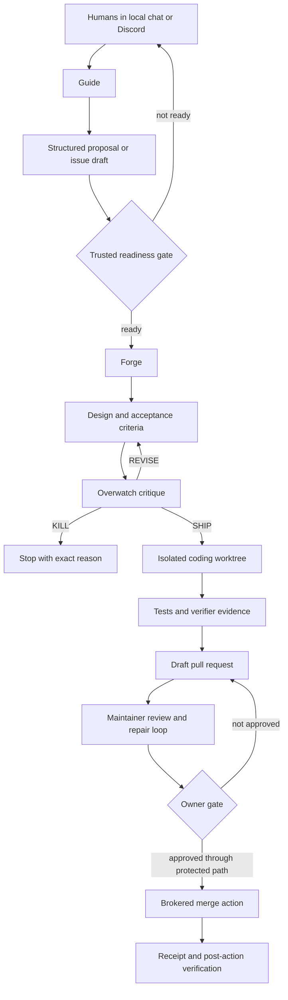

# The John Domain, explained for humans

This guide explains what John Lomein is, what the five profiles do, and which parts are controlled by natural-language instructions versus deterministic software.

## The shortest correct explanation

John Lomein is not one chatbot.

It is a small software-development organization built inside Hermes.

The organization has five named roles, a shared identity, a memory service, a repository workspace, and mechanical safety rails. The model supplies judgment and language. Code supplies sequence, permissions, validation, evidence, and stopping rules.

**The SOUL files describe behavior. They do not enforce authority by themselves.**

## The two layers

### Layer 1: the human layer

This layer explains who John is and how each role should think and communicate.

It includes:

- `persona/JOHN_LOMEIN.md` — the shared John identity.
- `profiles/*/SOUL.md` — the role-specific doctrine.
- `skills/*/SKILL.md` — the job playbooks.
- Prompt files — the expected task and response shape.
- Communication rules — tone, evidence language, and public-safety behavior.

This is where the owner has the strongest direct contribution. It controls personality, priorities, reasoning posture, vocabulary, intent, and the meaning of a good result.

### Layer 2: the machine layer

This layer makes the rules real.

It includes:

- manifest validation;
- profile separation;
- deployment compilation;
- hooks;
- triggers and schedules;
- worker processes;
- isolated branches and worktrees;
- guarded `git` and `gh` commands;
- effect budgets;
- state machines;
- signed or hashed receipts;
- independent verification;
- operating-system file sandboxes;
- separate credential holders;
- Doctor and status checks.

This layer does not rely on the model being obedient. If a protected condition is false, the action fails even when the model asks for it.

## The whole system on one page

The important point is that public conversation does not jump directly to coding. Coding does not jump directly to merge. Every boundary has a separate gate.

## The five roles

### Guide: the front desk

Guide talks to people. It explains John, understands requests, and shapes useful proposals.

Guide has no normal terminal, filesystem, or GitHub credentials. It cannot secretly code or merge. In public Discord, it treats public text as suggestion data.

Guide can help a human turn an idea into a clear issue-shaped proposal. A deterministic intake mechanism or trusted human must still grant readiness.

### Forge: the builder

Forge converts one ready issue into a technical design and then a draft pull request.

Forge works through this sequence:

1. select one issue that passed the readiness gate;
2. write acceptance criteria;
3. ask Overwatch for critique;
4. revise, stop, or proceed;
5. create an isolated worktree and branch;
6. implement the smallest approved change;
7. run tests and verification;
8. open a draft pull request;
9. request code review.

Forge cannot merge, publish, release, change secrets, change settings, or force-push.

### Overwatch: the skeptical reviewer

Overwatch is the person in the room who asks, “Are we sure?”

It checks designs, runtime health, worker health, configuration drift, queue problems, and evidence quality. It is encouraged to return `REVISE` or `KILL` when work is vague, duplicated, unsafe, or dependent on an owner decision.

Overwatch does not build the feature it reviews.

### Maintainer: the repair and review loop

Maintainer watches existing pull requests.

It checks the latest commit, tests, CI, reviews, unresolved threads, and whether the PR still matches repository policy. It may prepare or perform narrowly allowed repairs when coding authority is enabled.

Maintainer can move a PR toward a clean owner gate. It does not own the final merge or publication decision.

### Learning Steward: the librarian

Learning Steward processes structured observations from the other roles.

It updates bounded private learning records and prepares candidate improvements. It does not rewrite John’s personality or skills automatically. Proposed self-improvements remain quarantined until reviewed.

## How identity is assembled

The product contains one canonical John persona and five role templates.

During deployment, the installer combines:

- the shared persona;
- the selected role;
- the repository mission;
- the instance name;
- authority settings;
- forbidden paths;
- readiness labels;
- communication rules.

It refuses to install a SOUL file with unresolved placeholders. The result is a complete profile-specific identity, not a loose collection of Markdown fragments.

## What the instance manifest does

The instance manifest is the owner-controlled configuration card for one repository.

It says:

- which repository John serves;
- John’s mission for that repository;
- which model to use;
- which test command proves correctness;
- which paths are forbidden;
- which labels indicate readiness;
- whether Discord is enabled;
- whether coding is enabled;
- which schedules and budgets apply;
- which user IDs are owners or trusted collaborators;
- whether protected release machinery exists.

The manifest is validated before deployment. Invalid authority combinations or unsafe paths fail before services are changed.

## Profiles and capability separation

Each role is an official Hermes profile distribution.

A profile has its own:

- SOUL;
- skills;
- configuration;
- sessions;
- credential-free provider binding;
- logs;
- state;
- Honcho identity.

Profiles do not all receive the same tools. Guide is deliberately weaker than Forge and Maintainer.

Model roles do not receive provider credentials. A controller-owned broker
keeps the real OAuth material outside the model sandbox, accepts only the
small Codex HTTP surface Hermes needs over a per-process Unix socket, and owns
the fixed upstream host. A second controller-owned socket restores local
Honcho without reopening loopback: it is pinned to the configured workspace
and permits message writes only when that profile's `saveMessages` policy does.
Direct loopback, PostgreSQL, Redis, and Internet connections remain denied.

The operating-system sandbox makes identity files, security configuration, memory configuration, scripts, plugins, and credential surfaces read-only inside model processes.

## Triggers, schedules, and workers

The scheduler does not ask a model to run constantly.

Cheap deterministic triggers first inspect queue state. A trigger starts a worker only when work exists and policy permits it.

A worker has:

- a recorded process ID;
- a heartbeat;
- a log;
- a timeout;
- a fingerprint used to avoid duplicate work;
- a state directory;
- a specific role and task.

Long work happens in detached workers. This prevents one chat session or scheduler tick from owning an entire coding run.

## Git and GitHub guards

Models do not receive unrestricted `git` and `gh` behavior.

John deploys guarded wrappers that classify the intended effect.

Examples of different effects are:

- read repository state;
- create a branch;
- push a permitted branch;
- open a draft PR;
- write a public comment;
- resolve a thread;
- promote a draft;
- merge;
- publish.

Each effect has its own authority rule and daily budget. An allowed comment does not imply an allowed merge.

Forbidden paths and unsafe branch operations fail before execution.

## Evidence and receipts

A model saying “done” is not accepted as proof.

John distinguishes:

- a plan;
- a dispatched command;
- an observed result;
- verifier-owned evidence;
- an owner approval;
- a protected-action receipt.

Completion belongs to deterministic verification, not to the model that performed the work.

Receipts bind important actions to exact repository, branch, commit, policy, request, and result information. This prevents an old approval or a copied message from authorizing a different action.

## Hooks

Hooks are small deterministic programs that run at specific Hermes events.

John currently has two important runtime plugins:

- **Continuity hook:** injects a bounded, role-appropriate continuity capsule when a session starts or a provider request is prepared.
- **Release-approval hook:** recognizes only the narrow protected release-approval path and injects verified current-turn evidence. It does not give Guide general execution power.

A hook can prepare context or verify an event. Its existence does not itself prove that a repository action succeeded.

## Memory has three separate jobs

### Honcho: human and conversational context

One local Honcho service is shared by the John profiles.

Each profile has a separate AI peer configuration. Guide can save identity-separated user messages. Automated worker roles use context recall with `saveMessages: false`, so scheduler prompts and repository text do not become the owner’s personal memory.

### Continuity ledger: bounded operational continuity

John also keeps a product-owned continuity record for bounded decisions, objections, refusals, and commitments. It is not a raw chat archive.

Public Guide receives only public-safe continuity. Private roles can receive a larger but still bounded projection.

### Private learning index: operational patterns

Learning Steward can maintain a private deterministic index of counts and pattern fingerprints. This supports operational learning without making a model-controlled memory provider authoritative.

These systems solve different problems. They should not be merged into one uncontrolled memory pool.

## Protected actions and credentials

The most dangerous actions are intentionally separated from the model runtime.

Merge and release machinery can use a separate owner gateway, signer, broker, key material, socket, and operating-system identity. The model may prepare a request packet. It cannot read the signing key or silently impersonate the owner.

In an observer-mode instance, this machinery remains disabled.

## Status versus Doctor

`status` is a fast, offline coherence check. It answers, “Does the installed instance match the approved configuration?”

`Doctor` performs live checks. It examines profiles, Honcho, GitHub access, checkout health, hooks, guards, workers, queue state, services, and protected gates.

A warning can mean an intentionally closed gate. A failure means the product’s claimed posture is not proven.

## How the owner can contribute without becoming a systems programmer

The owner does not need to write the mechanical implementation.

The highest-value inputs are:

1. **Personality:** What should this role value, notice, refuse, and explain?
2. **Intent:** What does a human mean when they ask for something?
3. **Ordering:** What must happen first, second, and never?
4. **Judgment:** What makes a proposal useful, risky, premature, or complete?
5. **Language:** What should John say at each gate?
6. **Examples:** What are good and bad conversations, issues, designs, PRs, and decisions?
7. **Measurements:** What behavior would prove the product is becoming better?

A useful change request can be written like this:

> When a public user proposes a feature, Guide may refine it across several turns while each exchange materially improves the shape, asks no more than one useful question per reply, and stops when clarification is exhausted. It should return a structured proposal containing problem, desired outcome, scope, constraints, success signals, risks, and evidence gaps. Forge—not Guide—creates the implementation design and final acceptance criteria after the owner-only readiness gate. The proposal must not become ready work until the owner marks it ready.

That human specification can then be translated into:

- SOUL or skill wording;
- manifest settings;
- state-machine conditions;
- tests;
- guard rules;
- metrics;
- Doctor checks.

The owner owns the desired behavior. Engineering converts it into deterministic enforcement.

## The safe way to improve John

For every proposed improvement:

1. describe the human behavior in plain language;
2. name the trigger;
3. name the allowed outcome;
4. name what must never happen;
5. provide one good example and one failure example;
6. identify the evidence that proves success;
7. write the failing test;
8. change the mechanical layer;
9. run Doctor and the full test suite;
10. activate the change gradually.

This keeps philosophy, product intent, and mechanical safety connected without requiring the owner to understand every line of code.
